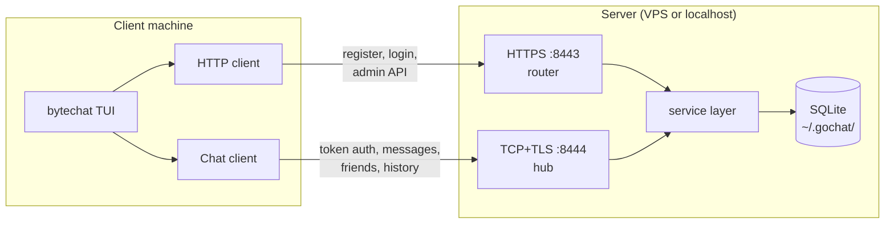
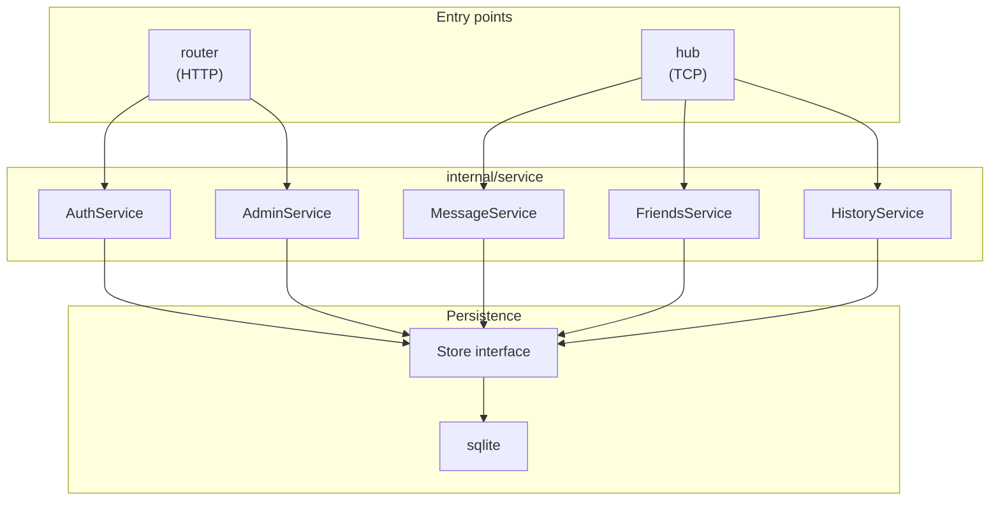
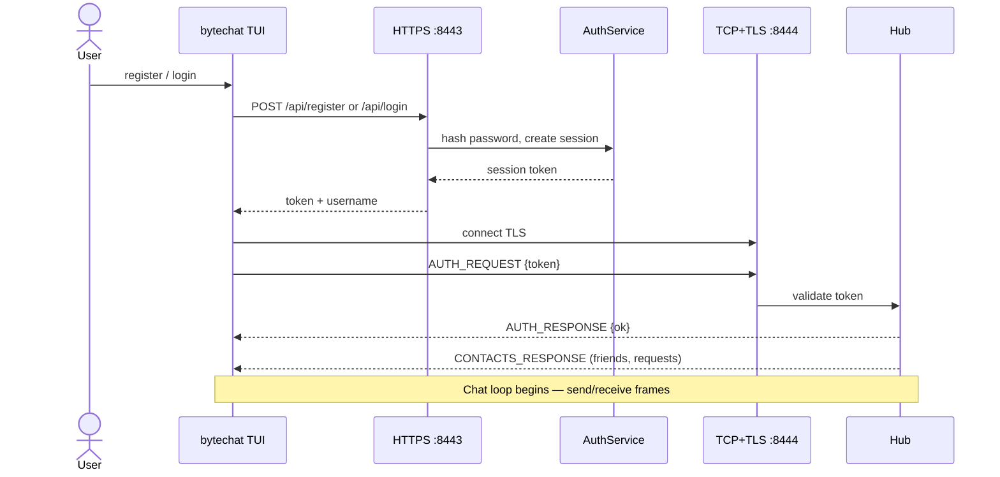
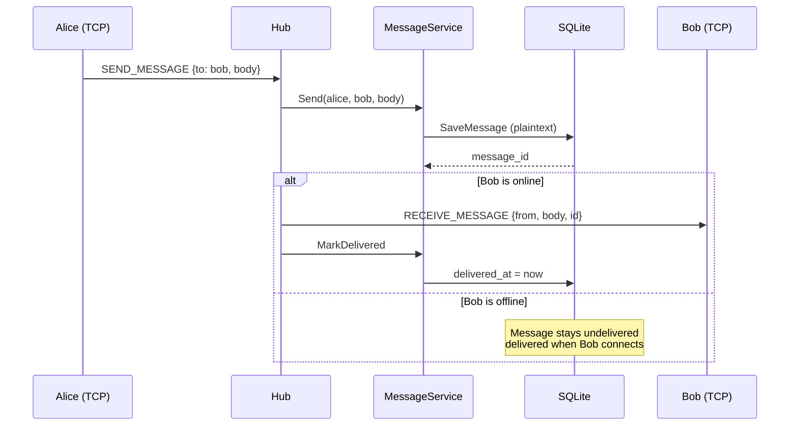
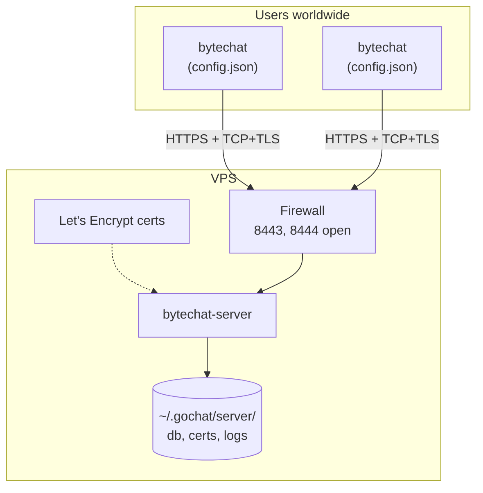

# byteChat

A self-hostable terminal chat application written in Go. Users register and log in over **HTTPS**, then connect to a **TCP+TLS** messaging server for real-time chat. The client is a [Bubble Tea](https://github.com/charmbracelet/bubbletea) TUI.

Run a server on your machine for local use, or deploy to a VPS and let anyone connect from anywhere.

> **Note:** Message bodies are stored on the server today (plaintext in SQLite). E2E key backup for multi-device login is partially implemented; **message-level encryption is not yet wired**. See [Security model](#security-model) and `todo.txt`.

## Table of contents

- [Requirements](#requirements)
- [Quick start (local)](#quick-start-local)
- [Client](#client)
- [Server](#server)
- [Hosting on a VPS](#hosting-on-a-vps)
- [Admin panel](#admin-panel)
- [Data on disk](#data-on-disk)
- [Logging](#logging)
- [Security model](#security-model)
- [Known limitations](#known-limitations)
- [Contributing](#contributing)
- [Building binaries](#building-binaries)
- [Running tests](#running-tests)
- [Architecture](#architecture)
  - [System overview](#system-overview)
  - [Server layers](#server-layers)
  - [Login and chat connection](#login-and-chat-connection)
  - [Message delivery](#message-delivery)
  - [VPS deployment](#vps-deployment)
- [Project structure](#project-structure)
- [Wire protocol](#wire-protocol)
- [HTTP API](#http-api)

## Requirements

- **Go 1.25+**
- A terminal with ANSI color support (Windows Terminal, iTerm2, etc.)

## Quick start (local)

Open two terminals in the project root.

**Terminal 1 — start the server**

```bash
# First time only: create an admin account
go run ./cmd/bytechat-server --create-admin admin:yourpassword

# Start the server (HTTPS :8443, chat :8444)
go run ./cmd/bytechat-server
```

**Terminal 2 — start the client**

```bash
go run ./cmd/bytechat
```

On the welcome screen:

| Key | Action |
|-----|--------|
| `l` | Log in |
| `r` | Register a new account |
| `~` | Admin login |
| `q` / `Ctrl+C` | Quit |

No config file is needed for local use. The client defaults to `localhost` and accepts the auto-generated self-signed certificate.

There is no built-in admin account — run `--create-admin` at least once before using admin login (`~`).

## Client

```bash
go run ./cmd/bytechat [flags]
# or, after building:
./bytechat [flags]
```

### Flags

| Flag | Default | Description |
|------|---------|-------------|
| `-server` | from config, else `https://localhost:8443` | HTTPS auth / admin URL |
| `-tcp` | derived from `-server` host + `:8444` | TCP+TLS chat address |
| `-insecure` | auto (`true` for localhost) | Skip TLS certificate verification |
| `-configure` | | Save settings to `~/.gochat/client/config.json` and exit |
| `-show-config` | | Print saved config and exit |

### Connecting to a remote server

**One-time setup** (share this with your users):

```bash
bytechat -configure -server https://chat.example.com:8443
```

This writes `~/.gochat/client/config.json`. The chat port (`:8444`) is filled in automatically from the hostname.

```json
{
  "server_url": "https://chat.example.com:8443",
  "tcp_addr": "chat.example.com:8444",
  "insecure_tls": false
}
```

Then run the client with no flags:

```bash
bytechat
```

The welcome screen displays which server you are connecting to. Use `-show-config` to inspect saved settings.

For a single session without saving config:

```bash
bytechat -server https://chat.example.com:8443
```

### Chat controls

| Key | Action |
|-----|--------|
| `1` / `2` / `3` | Friends / Incoming / Outgoing tabs |
| `↑` / `↓` | Select contact or request |
| `a` | Add friend (opens modal) |
| `Enter` | Send message, accept request, or submit modal |
| `Esc` | Close add-friend modal |
| `q` / `Ctrl+C` | Quit |

Only friends can message each other. Conversation history is loaded from the server when you open a chat.

## Server

```bash
go run ./cmd/bytechat-server [flags]
# or, after building:
./bytechat-server [flags]
```

### Flags

| Flag | Default | Description |
|------|---------|-------------|
| `-https-addr` | `:8443` | HTTPS listen address (auth + admin API) |
| `-tcp-addr` | `:8444` | TCP+TLS listen address (real-time chat) |
| `-create-admin` | *(empty)* | Create or promote admin (`username:password`) |
| `-tls-cert` | auto | Path to TLS certificate PEM |
| `-tls-key` | auto | Path to TLS private key PEM |
| `-tls-hostname` | *(empty)* | Hostname/IP for auto-generated self-signed cert |

The server binds to **all interfaces** by default, so `:8443` and `:8444` accept connections from the internet when deployed on a VPS.

### TLS

| Environment | Setup |
|-------------|--------|
| **Local dev** | Certs auto-generated on first run in `~/.gochat/server/`. Client skips verification for localhost. |
| **VPS (recommended)** | Use [Let's Encrypt](#3-tls-certificates) via `-tls-cert` / `-tls-key`. Clients verify TLS normally. |
| **VPS (testing only)** | Delete old certs, start with `-tls-hostname your.domain`. Clients need `-insecure` or `"insecure_tls": true`. |

### Create an admin

```bash
go run ./cmd/bytechat-server --create-admin admin:yourpassword
```

Creates the user if missing, or promotes an existing user. Log in from the client welcome screen with **`~`**.

## Hosting on a VPS

byteChat is designed for self-hosting: run a server on a VPS, share your hostname, and users connect from anywhere.

### Overview

| Port | Protocol | Purpose |
|------|----------|---------|
| **8443** | HTTPS | Register, login, admin API |
| **8444** | TCP+TLS | Real-time chat |

```
User's laptop                         Your VPS
     │                                    │
     │  HTTPS :8443  (login/register)     │
     ├───────────────────────────────────►│
     │  TCP+TLS :8444  (chat)             │
     └───────────────────────────────────►│
```

**Server operator:** VPS + open ports + TLS + `--create-admin`  
**End user:** `bytechat -configure -server https://your-domain:8443`, then `bytechat`

### 1. DNS and firewall

1. Add an **A record** pointing your domain (e.g. `chat.example.com`) at the VPS IP.
2. Open ports on the firewall:

```bash
sudo ufw allow 8443/tcp
sudo ufw allow 8444/tcp
sudo ufw enable
```

### 2. Build and install

On the VPS:

```bash
git clone https://github.com/jek821/ByteChat.git
cd ByteChat
go build -o bytechat-server ./cmd/bytechat-server

sudo useradd -r -m bytechat 2>/dev/null || true
sudo install -D -o bytechat -g bytechat bytechat-server /opt/bytechat/bytechat-server
```

Create an admin (data stored in `/home/bytechat/.gochat/`):

```bash
sudo -u bytechat /opt/bytechat/bytechat-server --create-admin admin:your-secure-password
```

### 3. TLS certificates

Use a real certificate so clients trust the connection without `-insecure`:

```bash
sudo apt install certbot
# Ensure nothing is listening on port 80, then:
sudo certbot certonly --standalone -d chat.example.com
```

Start the server with the issued cert:

```bash
sudo -u bytechat /opt/bytechat/bytechat-server \
  -tls-cert /etc/letsencrypt/live/chat.example.com/fullchain.pem \
  -tls-key /etc/letsencrypt/live/chat.example.com/privkey.pem
```

For a persistent service, see `deploy/bytechat-server.service` (systemd example). The server stores data in the runtime user's home directory (`~/.gochat/` — e.g. `/home/bytechat/.gochat/` when running as user `bytechat`). Ensure the service unit allows writes to that path.

Renew certs with `certbot renew` — consider a cron job or systemd timer plus a reload hook.

### 4. Distribute the client

Users install or build `bytechat`, then run once:

```bash
bytechat -configure -server https://chat.example.com:8443
bytechat   # every time after that
```

Example config: `deploy/client-config.example.json`.

## Admin panel

Access from the client welcome screen with **`~`**. Requires an account created via `--create-admin`.

| Key | Action |
|-----|--------|
| `1`–`4` | Dashboard / Users / Logs / Wipe tabs |
| `r` | Refresh |
| `↑` / `↓` | Select user or log category |
| `d` | Delete user (press `d` twice to confirm) |
| `Space` | Toggle log category |
| `Esc` | Back to welcome (cancels pending delete) |

**Dashboard** — user/message/session counts, online users  
**Users** — list and delete accounts (cannot delete self or other admins)  
**Logs** — toggle log categories at runtime  
**Wipe** — type `WIPE DATABASE` and press Enter to erase all data

## Data on disk

All data lives under `~/.gochat/` (`%USERPROFILE%\.gochat\` on Windows):

```
~/.gochat/
  server/
    gochat.db          SQLite database
    cert.pem           TLS certificate (auto-generated)
    key.pem            TLS private key
    log_config.json    Log category toggles
  client/
    config.json        Server connection (from bytechat -configure)
    e2e_keys/          Friend public keys (E2E)
    e2e_private.pem
    e2e_public.pem
```

Delete `gochat.db` or use the admin **Wipe** tab to reset server data.

## Logging

Structured logs go to stderr. Toggle categories in the admin **Logs** tab or edit `log_config.json`:

| Category | Logged |
|----------|--------|
| `server` | Startup, listen addresses |
| `http` | Method, path, status, duration |
| `tcp` | Connect/disconnect (username only) |
| `messaging` | Message id, from, to — **not** body text |
| `friends` | Friend requests and acceptances |
| `admin` | Admin actions |
| `store` | Migrations, user create/delete, message metadata |

**Never logged:** message bodies, passwords, tokens, or other auth secrets.

## Security model

| Layer | Status |
|-------|--------|
| **Transport** | TLS on HTTPS (`8443`) and chat (`8444`). Use Let's Encrypt on public VPS deployments. |
| **Authentication** | Argon2 password hashes; random session tokens (hashed at rest). |
| **Sessions** | Tokens do not expire automatically and there is no logout/revoke API yet — see `todo.txt`. |
| **Messages** | Plaintext in SQLite on the server. The server (and anyone with DB access) can read message content. |
| **E2E keys** | X25519 keypairs are generated on register; encrypted private keys can be stored on the server for device restore. **Messages are not encrypted with these keys yet.** |
| **Admin** | Same bearer token as chat, plus `is_admin` flag. Protect admin accounts accordingly. |

Self-hosted operators control the server and database. Users should trust whoever runs the VPS.

## Known limitations

These are documented in detail in [`todo.txt`](todo.txt):

- **Optimistic send** — the UI may show a message even if the server rejected it (e.g. not friends); TCP error responses are not implemented yet.
- **No session revocation** — tokens remain valid until the user is deleted or the DB is wiped.
- **Shared-machine E2E keys** — one local key file per machine, not per account; avoid multiple accounts on the same client install until fixed.
- **Two open ports** — both `8443` and `8444` must be reachable; no single-port reverse-proxy setup documented.
- **No rate limiting** on login/register.
- **Admin wipe** clears the database but does not force-disconnect active chat clients immediately.

## Contributing

See [`todo.txt`](todo.txt) for a prioritized backlog (bugs, security, E2E, tests, ops).

```bash
go test ./...
go build ./cmd/bytechat-server ./cmd/bytechat
```

Pull requests welcome. For large changes (E2E messaging, protocol changes), open an issue first to align on approach.

## Building binaries

```bash
go build -o bytechat-server ./cmd/bytechat-server
go build -o bytechat ./cmd/bytechat
```

## Running tests

```bash
go test ./...
```

## Architecture

### System overview

byteChat uses **two TLS connections** between each client and the server: HTTPS for auth/admin, TCP+TLS for real-time chat.



| Connection | Port | Used for |
|------------|------|----------|
| HTTPS | 8443 | Register, login, admin REST API |
| TCP+TLS | 8444 | Session token auth, chat, friends, history |

---

### Server layers

Both listeners share the same **service** and **store** stack; only the entry point differs.



**`bytechat-server`** starts both listeners, loads TLS certs once, and wires services into the router and hub.

---

### Login and chat connection

Auth happens over HTTPS; the returned token opens the long-lived chat socket.



---

### Message delivery

Messages are stored in SQLite first, then pushed to the recipient if they are online.



Only **friends** can message each other. The server stores message bodies in plaintext today (see [Security model](#security-model)).

---

### VPS deployment

Self-hosted layout when the server runs on a VPS and users connect from anywhere.



**Operator:** build server, open ports, attach TLS certs, `--create-admin`  
**User:** `bytechat -configure -server https://your-domain:8443` once, then `bytechat`

See [Hosting on a VPS](#hosting-on-a-vps) for step-by-step instructions.

---

### Layer summary (text)

```
client (TUI)
  ├─ HTTPS  →  router       register, login, admin API
  └─ TCP+TLS →  hub          token auth, real-time messaging
                    ↓
                service      auth, messages, friends, history, admin
                    ↓
                store        database interface
                    ↓
                sqlite       SQLite implementation
```

## Project structure

```
cmd/
  bytechat/              Bubble Tea client
  bytechat-server/       HTTPS + TCP+TLS server

deploy/
  bytechat-server.service   systemd unit example
  client-config.example.json

internal/
  client/                HTTP/TCP clients, config, TLS helpers
  logx/                  Structured logging
  paths/                 ~/.gochat/ path helpers
  protocol/              Length-prefixed JSON frames
  router/                HTTP routes (auth + admin)
  server/                TCP hub, TLS, listener
  service/               Business logic
  store/sqlite/          SQLite store and migrations
  tui/                   Terminal UI

pkg/types/               Shared types
```

## Wire protocol

TCP+TLS messages use length-prefixed JSON (`internal/protocol/frame.go`):

```
[4 bytes: payload length (uint32 big-endian)][N bytes: JSON payload]
```

Envelope shape — note the field is **`code`**, not `type`:

```json
{"code": 1, "data": {"to_username": "alice", "body": "hello"}}
```

`code` values are defined in `internal/protocol/protocol.go` (e.g. `SEND_MESSAGE`, `RECEIVE_MESSSAGE`, `REQUEST_HISTORY`). The inner `data` object depends on the code — see `internal/protocol/messages.go`.

Max frame size: 1 MiB. Client TUI input is capped at 512 characters; the server does not enforce that limit yet.

## HTTP API

### Public auth

| Method | Path | Description |
|--------|------|-------------|
| `POST` | `/api/register` | Create account |
| `POST` | `/api/login` | Log in, receive session token |

### Admin

All routes except login require `Authorization: Bearer <token>`.

| Method | Path | Description |
|--------|------|-------------|
| `POST` | `/api/admin/login` | Admin login |
| `GET` | `/api/admin/dashboard` | Stats, online users, log config |
| `GET` | `/api/admin/users` | List users |
| `DELETE` | `/api/admin/users/{username}` | Delete user |
| `POST` | `/api/admin/wipe` | Wipe DB — body: `{"confirm":"WIPE DATABASE"}` |
| `GET` | `/api/admin/logs` | Get log config |
| `PUT` | `/api/admin/logs/{category}` | Toggle category — body: `{"enabled":true}` |
